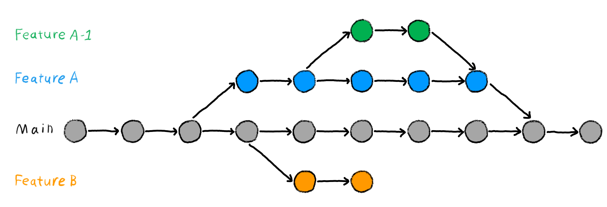

# GUIDE_ORGANISATION_GIT

## Table of Contents / Sommaire
- [GUIDE\_ORGANISATION\_GIT](#guide_organisation_git)
  - [Table of Contents / Sommaire](#table-of-contents--sommaire)
  - [Objectif](#objectif)
  - [Structure des Dossiers](#structure-des-dossiers)
    - [Explication des Dossiers](#explication-des-dossiers)
  - [Utilisation de Git](#utilisation-de-git)
    - [Création et Utilisation des Branches](#création-et-utilisation-des-branches)
    - [Fusionner les Branches](#fusionner-les-branches)
  - [Bonnes Pratiques](#bonnes-pratiques)

## Objectif

Ce fichier a pour objectif d'expliquer comment travailler efficacement avec Git en groupe et comment sont organisés les fichiers et dossiers du projet.

## Structure des Dossiers

```
.
├── README.md
├── code
│   └── [Projet ft_irc]
└── documentation
	├── Documentation.md
	├── GUIDE_ORGANISATION_GIT.md
	├── ilusatrion
	│   └── [Plusieur image]
	├── laboratoire
	│   └── [Plusieur dossier test en c++98]
	├── other
	│   └── bircd.tar.gz
	└── subject
	    └── fr.subject.FT_irc.pdf
```

### Explication des Dossiers

- `README.md` : Contient une description générale du projet, des instructions d'installation et d'utilisation.

- **code** : Contient le projet principal `ft_irc`, incluant le fichier `Makefile`, les fichiers d'en-tête (.hpp), et les fichiers sources (.cpp).

- **documentation** : Contient toute la documentation du projet, y compris :
  - `Documentation.md` : Document de référence pour l'utilisation du projet.
  - `GUIDE_ORGANISATION_GIT.md` : Ce guide d'organisation et d'utilisation de Git.
  - **ilusatrion** : Contient plusieurs images png jpeg etc.
  - **laboratoire** : Contient plusieurs dossiers avec des exemples de code en C++98 pour différentes fonctions système.
  - **other** : Contient des fichiers divers fournis avec le sujet du projet.
    - `bircd.tar.gz` : Archive TAR fournie avec le sujet.
  - **subject** : Contient l'énoncé du sujet du projet.
    - `fr.subject.FT_irc.pdf` : Énoncé du sujet en PDF.

## Utilisation de Git



Pour une collaboration efficace, voici comment nous utilisons les branches et les fusions (merge) dans Git.

### Création et Utilisation des Branches

Chaque nouvelle fonctionnalité ou correction de bug doit être développée dans une branche séparée.

1. **Créer une nouvelle branche** :
    ```bash
    git checkout -b nom_de_votre_branche
    ```

2. **Faire des modifications** :
    Modifiez ou ajoutez des fichiers selon les besoins.

3. **Ajouter et valider vos modifications** :
    ```bash
    git add .
    git commit -m "Description de vos modifications"
    ```

4. **Pousser la branche vers le dépôt distant** :
    ```bash
    git push origin nom_de_votre_branche
    ```

### Fusionner les Branches

Une fois que vous avez terminé vos modifications et que vous les avez poussées vers le dépôt distant, créez une Pull Request (PR) sur GitHub pour fusionner votre branche dans la branche principale (main ou master).

1. **Mettre à jour la branche principale** :
    ```bash
    git checkout main
    git pull origin main
    ```

2. **Fusionner votre branche** :
    ```bash
    git merge nom_de_votre_branche
    ```

3. **Résoudre les conflits (s'il y en a)** :
    Si des conflits apparaissent, éditez les fichiers en conflit, puis :
    ```bash
    git add .
    git commit -m "Résolution des conflits"
    ```

4. **Pousser les modifications fusionnées** :
    ```bash
    git push origin main
    ```

## Bonnes Pratiques

- **Nommer les branches de manière descriptive** : Utilisez des noms de branches clairs et significatifs (e.g., `feature/ajout-authentification` ou `bugfix/correction-typo`).
- **Commits fréquents** : Faites des commits fréquents avec des messages descriptifs pour documenter vos modifications.
- **Pull Requests (PR)** : Utilisez des PR pour revoir le code avant de le fusionner dans la branche principale.
- **Mise à jour régulière** : Mettez régulièrement à jour votre branche locale avec la branche principale pour minimiser les conflits.

En suivant ces directives, nous pouvons garantir une collaboration efficace et organisée sur notre projet.