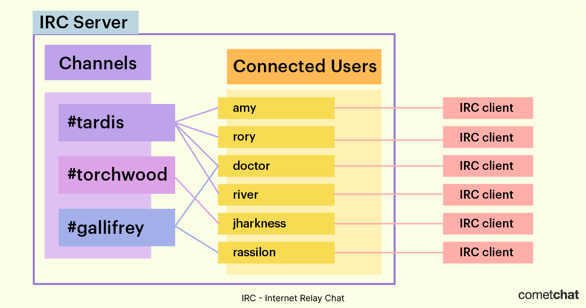

# Serveur IRC (Internet Relay Chat)

## Table of Contents / Sommaire
- [Serveur IRC (Internet Relay Chat)](#serveur-irc-internet-relay-chat)
  - [Table of Contents / Sommaire](#table-of-contents--sommaire)
  - [Introduction](#introduction)
  - [Fonctionnalités Principales](#fonctionnalités-principales)
  - [Exemples de Logiciels de Serveur IRC](#exemples-de-logiciels-de-serveur-irc)
  - [Protocole IRC (Internet Relay Chat)](#protocole-irc-internet-relay-chat)
    - [Introduction](#introduction-1)
    - [Fonctionnement](#fonctionnement)
    - [Commandes Principales](#commandes-principales)
    - [Structure des Messages IRC](#structure-des-messages-irc)
    - [Types de Messages](#types-de-messages)
    - [Modes et Permissions](#modes-et-permissions)
    - [Avantages du Protocole IRC](#avantages-du-protocole-irc)
    - [Inconvénients du Protocole IRC](#inconvénients-du-protocole-irc)
    - [Ressources Utiles](#ressources-utiles)
  - [Installation de UnrealIRCd](#installation-de-unrealircd)
    - [Prérequis](#prérequis)
    - [Étapes d'Installation (Linux)](#étapes-dinstallation-linux)
  - [Configuration de Base](#configuration-de-base)
    - [Exemple de Configuration `unrealircd.conf`](#exemple-de-configuration-unrealircdconf)
  - [Sécurité](#sécurité)
  - [Administration et Maintenance](#administration-et-maintenance)
  - [Ressources Utiles](#ressources-utiles-1)

## Introduction



Un serveur IRC (Internet Relay Chat) est une application qui permet de gérer et de faciliter les communications en temps réel via le protocole IRC. Les serveurs IRC permettent aux utilisateurs de se connecter et de participer à des discussions de groupe appelées "canaux" ainsi qu'à des conversations privées.

## Fonctionnalités Principales
- **Gestion des utilisateurs** : Enregistrement, connexion et gestion des utilisateurs.
- **Gestion des canaux** : Création, suppression, et gestion des canaux de discussion.
- **Messages privés** : Permettre les conversations privées entre utilisateurs.
- **Modération** : Outils pour modérateurs, tels que l'expulsion, la mise en sourdine, et la gestion des droits des utilisateurs.
- **Support des protocoles** : Support du protocole IRC (RFC 1459).

## Exemples de Logiciels de Serveur IRC
- **UnrealIRCd** : Un serveur IRC open-source avec de nombreuses fonctionnalités et une sécurité améliorée.
- **ircd** : Un serveur IRC de base, simple à configurer et à utiliser.
- **InspIRCd** : Un serveur IRC modulaire et hautement configurable.

---


## Protocole IRC (Internet Relay Chat)

Le protocole IRC (Internet Relay Chat) est un protocole de communication textuelle en temps réel utilisé pour les discussions en groupe (appelées "canaux") ainsi que pour les conversations privées entre utilisateurs. Il est principalement utilisé pour créer des réseaux de discussion accessibles via des serveurs IRC. Voici une explication détaillée du protocole IRC :

### Introduction
Le protocole IRC est défini dans la RFC 1459, publiée en 1993. Il est conçu pour permettre la communication en temps réel sur Internet. IRC fonctionne selon une architecture client-serveur, où les utilisateurs (clients) se connectent à un serveur IRC pour rejoindre des canaux de discussion ou engager des conversations privées.

### Fonctionnement
IRC utilise un modèle de connexion persistant entre le client et le serveur. Les messages échangés peuvent être de plusieurs types, y compris des messages de texte, des commandes et des notifications d'événements.

### Commandes Principales
Voici quelques-unes des commandes IRC les plus courantes :

- **NICK** : Utilisée pour définir ou changer le pseudonyme de l'utilisateur.
    ```plaintext
    NICK <nouveau_pseudonyme>
    ```

- **USER** : Utilisée pour fournir des informations sur l'utilisateur lors de la connexion initiale.
    ```plaintext
    USER <nom_utilisateur> <mode> <nom_serveur> <nom_réel>
    ```

- **JOIN** : Utilisée pour rejoindre un canal.
    ```plaintext
    JOIN <nom_du_canal>
    ```

- **PART** : Utilisée pour quitter un canal.
    ```plaintext
    PART <nom_du_canal>
    ```

- **PRIVMSG** : Utilisée pour envoyer un message privé à un utilisateur ou un message public à un canal.
    ```plaintext
    PRIVMSG <cible> :<message>
    ```

- **QUIT** : Utilisée pour se déconnecter du serveur IRC.
    ```plaintext
    QUIT :<message_de_quit>
    ```

### Structure des Messages IRC
Les messages IRC suivent une syntaxe simple et claire. Un message IRC typique est composé de trois parties : le préfixe (optionnel), la commande, et les paramètres.

```plaintext
<préfixe> <commande> <paramètres>
```

Exemple :
```plaintext
:example.com 001 user :Bienvenue sur le serveur IRC
```

### Types de Messages
1. **Messages de Commandes** : Utilisés pour les interactions fonctionnelles, telles que la connexion, la déconnexion, et la gestion des canaux.
2. **Messages de Réponse** : Utilisés par le serveur pour répondre aux commandes envoyées par les clients.
3. **Messages d'Événements** : Notifications envoyées par le serveur pour informer les clients des actions effectuées par d'autres utilisateurs (par exemple, un utilisateur rejoignant ou quittant un canal).

### Modes et Permissions
IRC permet aux utilisateurs et aux canaux de définir des modes et des permissions spécifiques pour contrôler le comportement et l'accès. Par exemple, un canal peut être configuré pour être privé, modéré, ou limité à un certain nombre d'utilisateurs.

- **Modes Utilisateur** : Définissent des permissions spéciales pour un utilisateur (opérateur, administrateur, etc.).
- **Modes Canal** : Définissent des restrictions ou des permissions pour un canal (privé, modéré, etc.).

### Avantages du Protocole IRC
- **Simplicité** : Facile à comprendre et à implémenter.
- **Flexibilité** : Supporte un large éventail de cas d'utilisation, de la discussion informelle aux conférences en ligne.
- **Modularité** : Les serveurs IRC peuvent être étendus avec des scripts et des modules pour ajouter des fonctionnalités supplémentaires.

### Inconvénients du Protocole IRC
- **Sécurité** : Les communications IRC ne sont pas chiffrées par défaut, ce qui peut poser des problèmes de sécurité.
- **Vieillissant** : Bien qu'encore utilisé, IRC a été supplanté par des protocoles de chat plus modernes pour de nombreuses applications.

### Ressources Utiles
- [RFC 1459 - Internet Relay Chat Protocol](https://tools.ietf.org/html/rfc1459) : Le document de spécification original du protocole IRC.
- [IRC.org](http://www.irc.org/) : Site web contenant des informations et des ressources sur IRC.
- [UnrealIRCd Documentation](https://www.unrealircd.org/docs/) : Documentation pour UnrealIRCd, un des serveurs IRC les plus populaires.

En résumé, le protocole IRC est une méthode éprouvée pour la communication textuelle en temps réel sur Internet, offrant une architecture client-serveur robuste et flexible pour la discussion en groupe et les conversations privées.

---

## Installation de UnrealIRCd

### Prérequis
- Un serveur Linux ou Windows
- Accès root ou administrateur
- Compilateur C (gcc)
- Logiciel de gestion de paquets (apt, yum, etc.)

### Étapes d'Installation (Linux)
1. **Mettre à jour les paquets**
    ```bash
    sudo apt update && sudo apt upgrade
    ```

2. **Installer les dépendances**
    ```bash
    sudo apt install build-essential tcl-dev libssl-dev
    ```

3. **Télécharger UnrealIRCd**
    ```bash
    wget https://www.unrealircd.org/downloads/UnrealIRCd-latest.tar.gz
    tar -xvzf UnrealIRCd-latest.tar.gz
    cd UnrealIRCd-<version>
    ```

4. **Configurer UnrealIRCd**
    ```bash
    ./Config
    ```

5. **Compiler et Installer**
    ```bash
    make
    sudo make install
    ```

6. **Configurer UnrealIRCd**
    - Modifier le fichier `unrealircd.conf` selon vos besoins.
    - Exemple de configuration minimale :
    ```conf
    listen *:6667;
    serverinfo {
        name "irc.example.com";
        network "ExampleNet";
        admin {
            "Admin Name";
            "admin@example.com";
        };
    };
    ```

7. **Démarrer le serveur**
    ```bash
    ./unrealircd start
    ```

## Configuration de Base
### Exemple de Configuration `unrealircd.conf`
```conf
listen *:6667;

serverinfo {
    name "irc.example.com";
    network "ExampleNet";
    admin {
        "Admin Name";
        "admin@example.com";
    };
    description "Example IRC Server";
};

ulines {
    "services.example.com";
};

set {
    network-name "ExampleNet";
    default-server "irc.example.com";
    services-server "services.example.com";
    stats-server "stats.example.com";
    help-channel "#help";
    hiddenhost-prefix "example-";
    modes-on-connect "+ixw";
};

allow {
    ip "*";
    hostname "*";
    class "clients";
};

class clients {
    pingfreq 90;
    maxclients 500;
    sendq 100000;
    recvq 8000;
};

class servers {
    pingfreq 90;
    maxclients 10; 
    sendq 1000000;
    connfreq 100; 
    recvq 8000;
};

oper Admin {
    class clients;
    from {
        userhost *@example.com;
    };
    password "password";
    flags {
        netadmin;
    };
};
```

## Sécurité
- **Utilisation du SSL/TLS** : Chiffrer les connexions entre les clients et le serveur pour protéger les données sensibles.
- **Pare-feu** : Configurer un pare-feu pour autoriser uniquement les ports nécessaires (par exemple, 6667 pour les connexions IRC non sécurisées, 6697 pour les connexions sécurisées).
- **Mise à jour régulière** : Garder le serveur et les logiciels à jour pour bénéficier des dernières corrections de sécurité.

## Administration et Maintenance
- **Logs** : Surveiller les logs pour détecter les activités suspectes.
- **Sauvegarde** : Effectuer des sauvegardes régulières des fichiers de configuration et des données utilisateur.
- **Scripts et Automatisation** : Utiliser des scripts pour automatiser les tâches courantes (redémarrage, sauvegarde, etc.).

## Ressources Utiles
- [Documentation officielle de UnrealIRCd](https://www.unrealircd.org/docs/)
- [RFC 1459 - Internet Relay Chat Protocol](https://tools.ietf.org/html/rfc1459)
